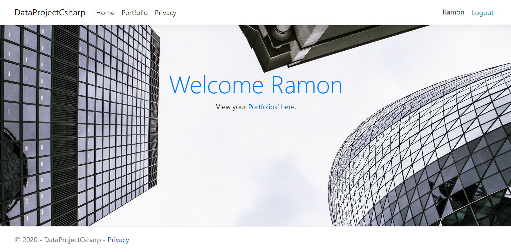
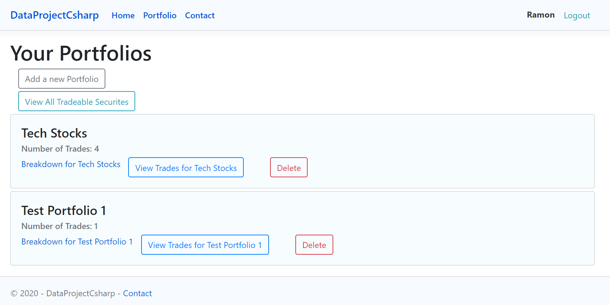
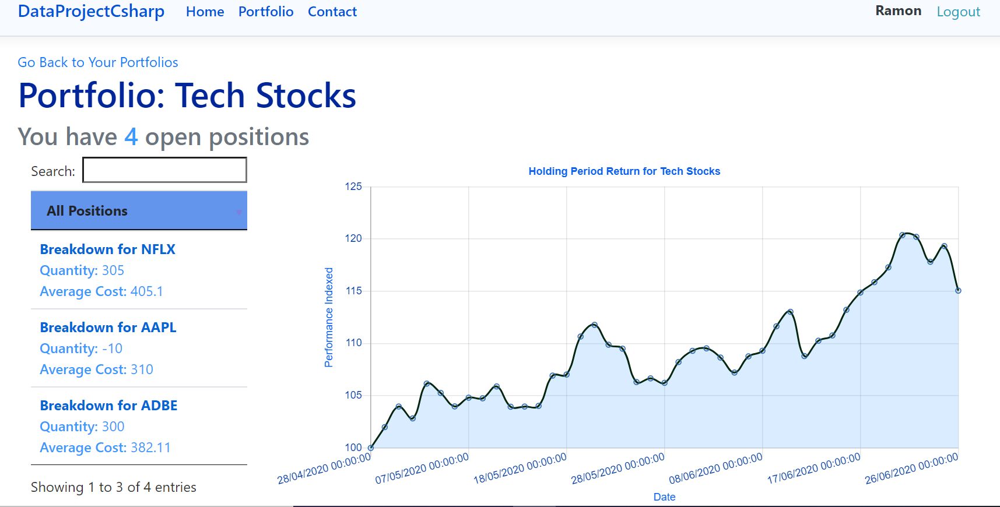
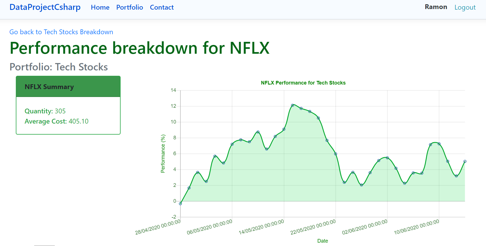

# Data Project C#
A Web Application that allows users to create dummy equity portfolios to monitor or test their trading strategies. Written in C# using the ASP.Net Core Framework

* Front-End: Bootstrap, Javscript, ChartJS
* Back-End: ASP.Net Core(C#), Entity Framework, MSSQL
* Other Libraries: Microsoft.Data.Analysis (For analytics)

# Table of Contents
- [Introduction](https://github.com/RamonWill/Data-App#Introduction)
- [Features](https://github.com/RamonWill/Data-App#Features)
- [How it Works](https://github.com/RamonWill/Data-App#How-It-Works)
- [Credits](https://github.com/RamonWill/Data-App#Credit)
- [Video Demo](https://github.com/RamonWill/Data-App#Video-Demo)
- [Screenshots](https://github.com/RamonWill/Data-App#Screenshots)

# Introduction
This application is very similar to the project I created in Python. I wanted to familiarise myself with a new programming language and decided to choose C#. This application allows users to create an unlimited number of portfolios to test out their strategies, monitor potential performance, or to simply track certain sectors. Users have a choice of over 1500+ equities from 10 different countries.

# Features
Other features of this Application include:
* Time-series Performance charts at a portfolio and security level
* Daily unrealised P&L breakdowns of their positions
* Perform CRUD operations on their portfolios

# How it Works
After Registration and logging in, A user can create a portfolio. The user can then add trades which will create positions. The site will then display and track the daily position of the users positions and portfolios. Equity prices are sourced from the Alpha Vantage API.

# Credits
A big thank you to the StackOverflow and Youtube communities for the answers and tutorials on how to use the ASP.NET Core Framework. I would also like to thank Alpha Vantage again for the easy access to a wide range of financial data. Finally, a special thanks to the  creators of the relatively new Microsoft Data Analysis package. I had to make a few workarounds due to it not being as fleshed out as Pandas (as of 2020), but nevertheless it made calculations A LOT easier and fast to perform.

* Disclaimer: This project is not valid financial tool. It is a project that I've created to help me learn more about C#. You should in no way use it to make investment decisions.

# Video-Demo
Coming Soon

# Screenshots

